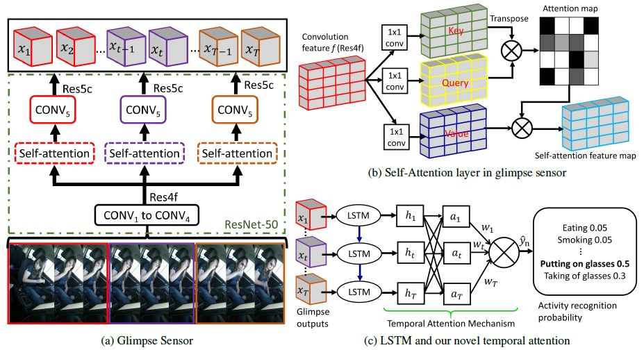

## Zachary Wharton, Ardhendu Behera, Yonghuai Liu and Nik Bessis 
**Department of Computer Science, Edge Hill University, United Kingdom**


### Abstract

There is significant progress in recognizing traditional human activities from videos focusing on highly distinctive actions involving discriminative body movements, body-object and/or human-human interactions. Driver's activities are different since they are executed by the same subject with similar body parts movements, resulting in subtle changes. To address this, we propose a novel framework by exploiting the spatiotemporal attention to model the subtle changes. Our model is named Coarse Temporal Attention Network (CTA-Net), in which coarse temporal branches are introduced in a trainable glimpse network. The goal is to allow the glimpse to capture high-level temporal relationships, such as ‘during’, ‘before’ and ‘after’ by focusing on a specific part of a video. These branches also respect the topology of the temporal dynamics in the video, ensuring that different branches learn meaningful spatial and temporal changes. The model then uses an innovative attention mechanism to generate high-level action specific contextual information for activity recognition by exploring the hidden states of an LSTM. The attention mechanism helps in learning to decide the importance of each hidden state for the recognition task by weighing them when constructing the representation of the video. Our approach is evaluated on four publicly accessible datasets and significantly outperforms the state-of-the-art by a considerable margin with only RGB video as input.

### CTA-Net Model Architecture
Our CTA-Net is based on ResNet-50 architecture and uses visual attention in an innovative way to capture both subtle spatiotemporal changes and coarse ('before', 'during' and 'after') temporal relationships. It attends <i>visual cues specific to  temporal segments</i> to preserve the temporal ordering in a given video and then a temporal attention mechanism, which dictates how much to <i>attend</i> the <i>current visual cues conditioned on their temporal neighborhood contexts</i>.

<p align="center" width="100%">
    <br>
    The proposed CTA-Net consists of - <b>a) Glimpse sensor:</b> Given an input video <i>v</i> consisting <i>T</i> frames, the sensor extract feature <i>x_t</i> for the frame located at time <i>t</i>, where <i>t=1 ... T</i>. <b>b) Self-Attention:</b> It captures important cues on activity-specific spatial changes. <b>c) Temporal Attention:</b> The module uses the internal state <i>h_t</i> of an LSTM (unrolled) that takes as input <i>x_t</i> and selectively focuses on the <i>h_t</i> to infer activity.
</p>

### Paper
[Edge Hill University Repository](https://research.edgehill.ac.uk/ws/portalfiles/portal/36372226/WACV_21_CameraReady.pdf)

### Bibtex
```markdown
@inproceedings{wharton2020coarse,
  title={Coarse Temporal Attention Network (CTA-Net) for Driver’s Activity Recognition},
  author={Wharton, Zachary and Behera, Ardhendu and Liu, Yonghuai and Bessis, Nik},
  booktitle={IEEE/CVF Winter Conference on Applications of Computer Vision (WACV)},
  year={2021},
  organization={IEEE Explore}
}
```

### Acknowledgements

This research was supported by the UKIERI (CHARM) under grant DST UKIERI-2018-19-10. The GPU is kindly donated by the NVIDIA Corporation.
